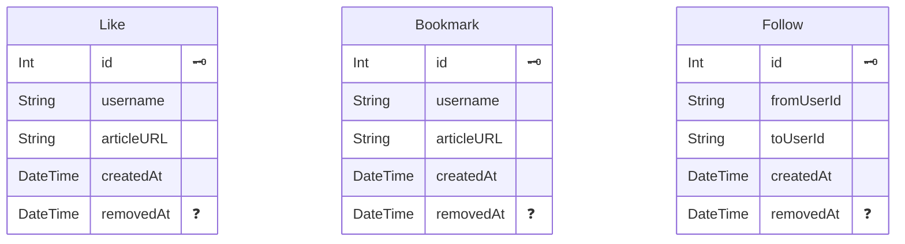

```mermaid
erDiagram

  "Like" {
    Int id "🗝️"
    String username
    String articleURL
    DateTime createdAt
    DateTime removedAt "❓"
    }


  "Bookmark" {
    Int id "🗝️"
    String username
    String articleURL
    DateTime createdAt
    DateTime removedAt "❓"
    }


  "Follow" {
    Int id "🗝️"
    String fromUserId
    String toUserId
    DateTime createdAt
    DateTime removedAt "❓"
    }

```
