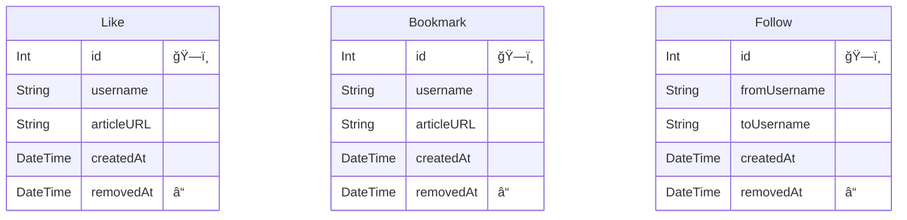

```mermaid
erDiagram

  "Like" {
    Int id "ğŸ—ï¸"
    String username
    String articleURL
    DateTime createdAt
    DateTime removedAt "â“"
    }


  "Bookmark" {
    Int id "ğŸ—ï¸"
    String username
    String articleURL
    DateTime createdAt
    DateTime removedAt "â“"
    }


  "Follow" {
    Int id "ğŸ—ï¸"
    String fromUsername
    String toUsername
    DateTime createdAt
    DateTime removedAt "â“"
    }

```
